# SSAFIT

🔔 본 프로젝트는 **삼성 청년 SW 아카데미 9기**  1학기 관통 프로젝트 결과물입니다

  

## **개요**

- SSAFIT 서비스는 Youtube Search API를 활용한 운동 영상 스크랩 및 공유 서비스입니다.

  

## 프로젝트 기간

- 2023년 5월 18일 ~ 2023년 5월 26일

 

 

## 기술 스택

   
   
   
   
   
   
  

######   

## 팀 소개

### TEAM !syntaxError

<table>
  <thead>
    <tr>
      <th>이름</th>
      <th>역할</th>
      <th>구현 기능</th>
    </tr>
  </thead>
  <tbody>
    <tr>
      <td rowspan="2">김용균</td>
      <td rowspan="2">팀장</td>
      <td>Back-End 전반</td>
    </tr>
    <tr>
      <td>Back-End (Rest API 설계, SQL/Spring 디버깅, 이미지 업로드, 매물 조회 게시판 카테고리/키워드 검색 등 필요 API 추가, DB 테이블 수정 등)</td>
    </tr>
    <tr>
      <td rowspan="2">신택수</td>
      <td rowspan="2">팀원</td>
      <td>Front-End 전반</td>
    </tr>
    <tr>
      <td>Front-End (메인 페이지 검색창 수정 및 매물 조회 게시판 디자인)</td>
    </tr>
  </tbody>
</table>

  

## **ER Diagram**

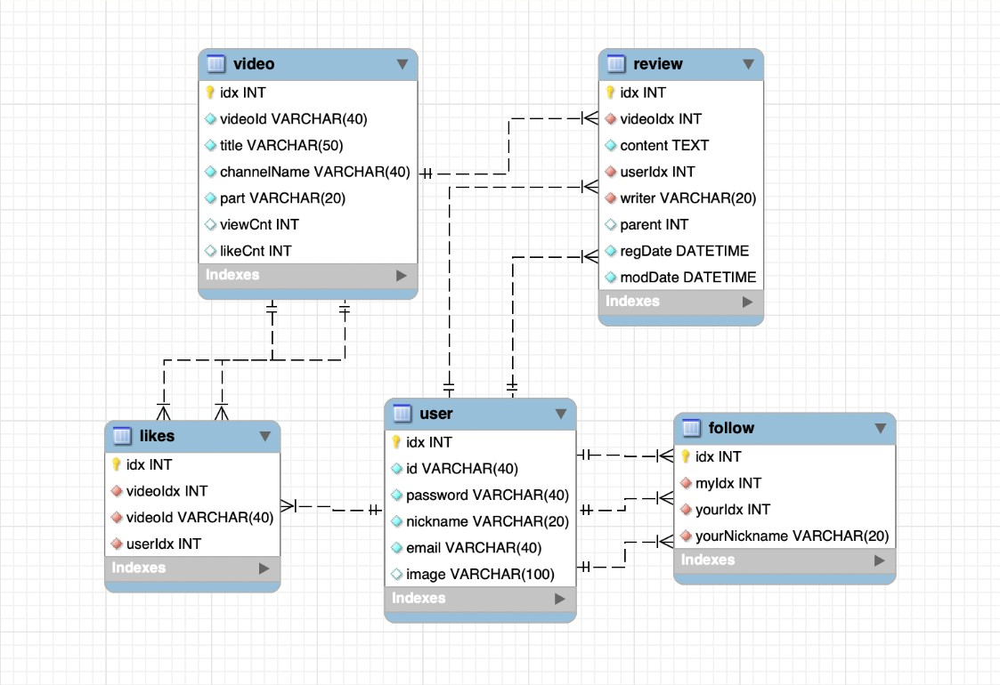

  

## Mock-Up

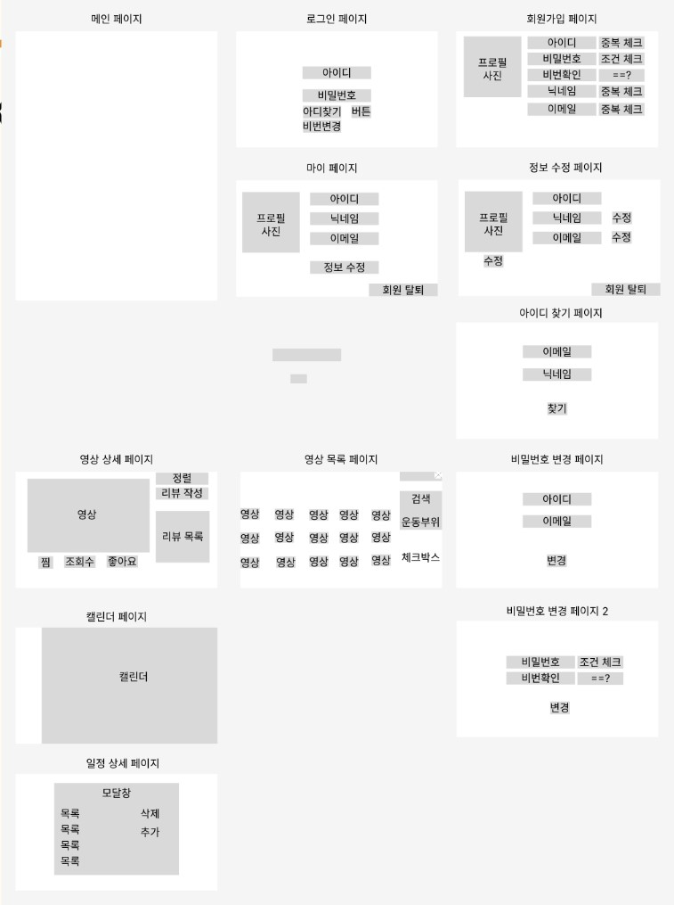

  

## API 명세서

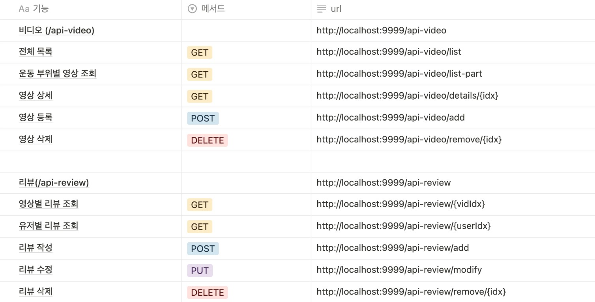
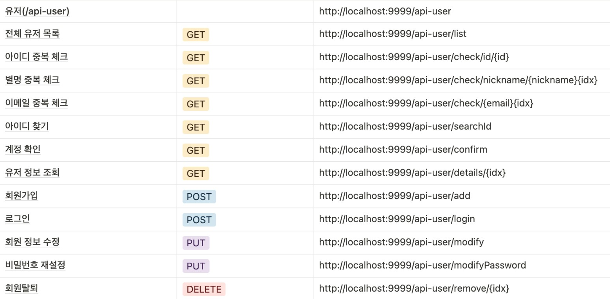
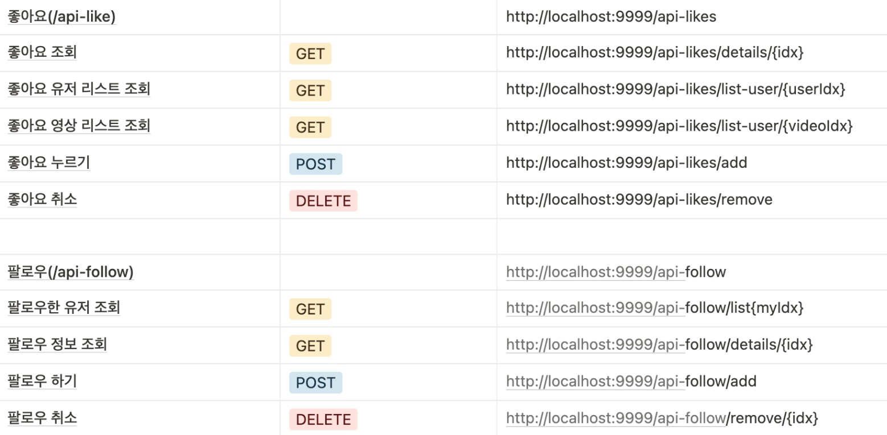

  

## 실행 화면

### **🔗 메인 페이지**

✅ 기본 UI 소개

  

---

### **🔗 메인 페이지 - 영상 정렬**

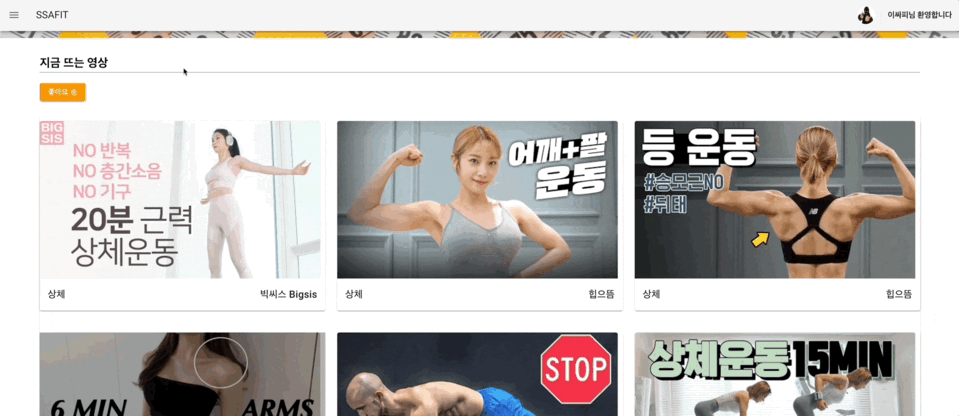

✅ 전체 영상 중 조회수 및 좋아요 상위 9개의 영상을 표시

  

---

### **🔗 회원가입**

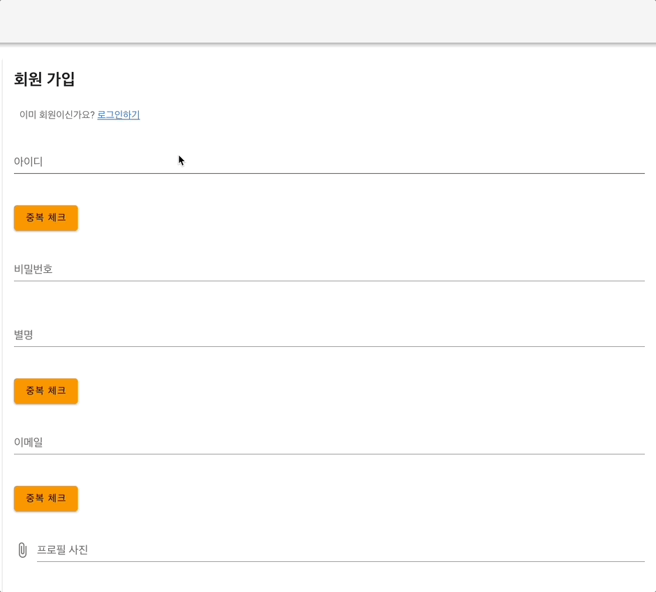

✅ 아이디, 별명, 이메일 중복 체크, 정규식 적용으로 실시간 조건 만족 여부 표시

✅ 프로필 사진 설정 가능

  

---

### **🔗 아이디 찾기**

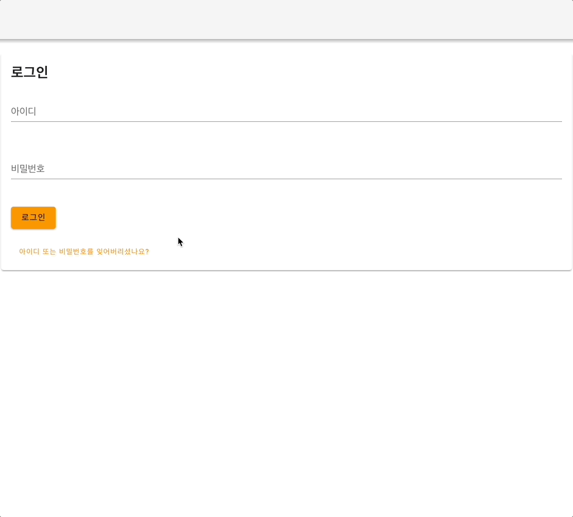

✅ 회원가입 시 입력한 이메일과 별명을 검증한 뒤 아이디를 알려줌

  

---

### **🔗 비밀번호 재설정**

✅ 아이디, 이메일, 별명을 입력 후 계정이 존재하는지 확인하고 비밀번호를 재설정, 정규식 및 실시간 조건 만족 여부 표시

  

---

### **🔗 로그인**

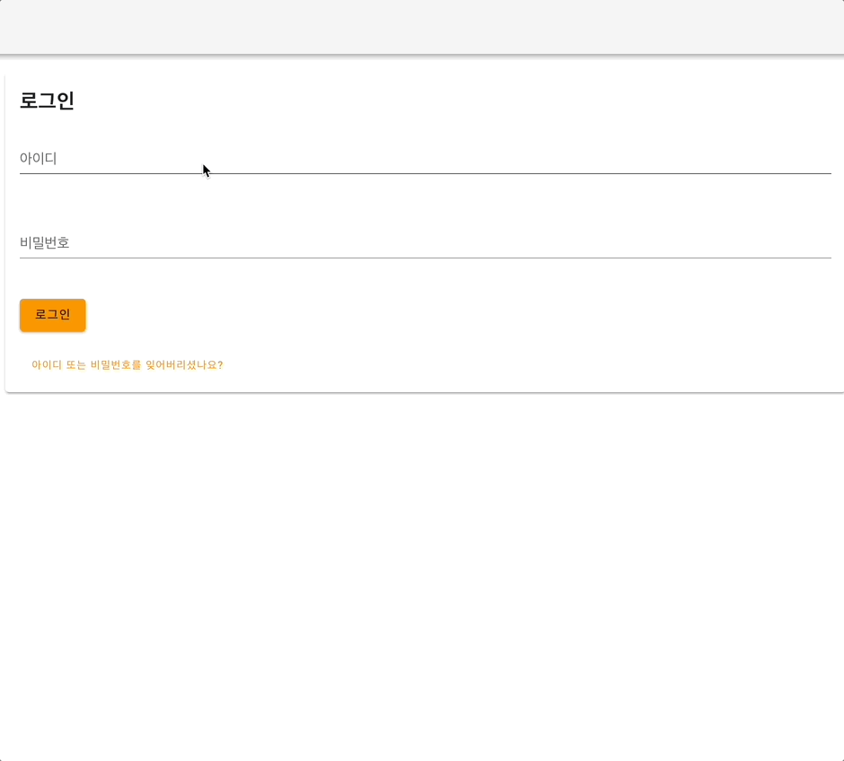

✅ JWT로 구현한 로그인 기능

  

---

### **🔗 마이페이지**

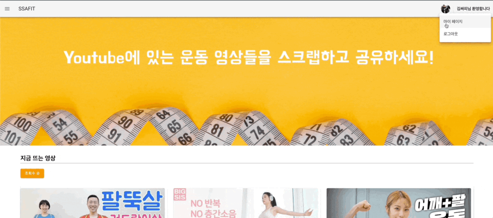
✅ 회원 정보 수정, 팔로우 유저 관리, 좋아요를 누른 영상 목록 표시

  

---

### **🔗 팔로우 목록**

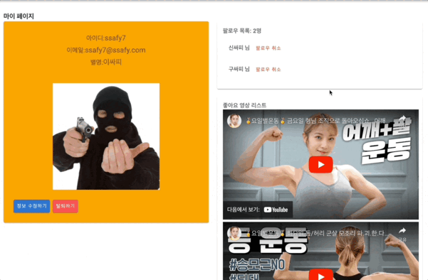. 
✅ 팔로우 유저 관리 및 팔로우한 유저가 좋아요를 표시한 영상 조회 가능

  

---

### **🔗 회원탈퇴**

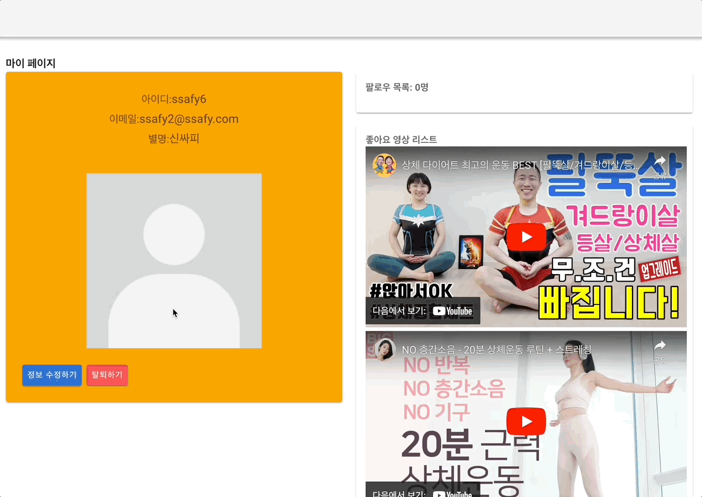

✅ 탈퇴확인을 위한 Dialog를 표시

  

---

### **🔗 영상 검색**

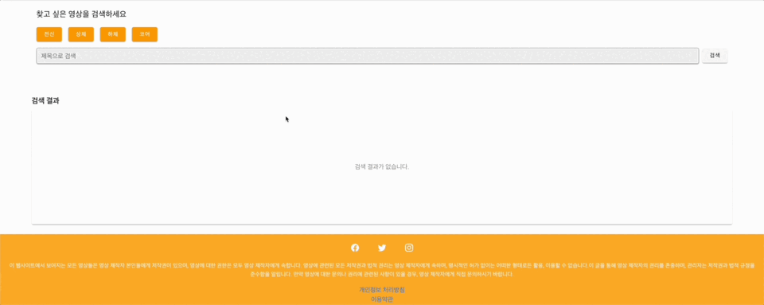

✅ 운동 부위별로 검색하기, 중복 선택 가능한 버튼으로 구현

✅ 제목에 포함된 키워드로도 검색 가능

  

---

### **🔗 영상 상세**

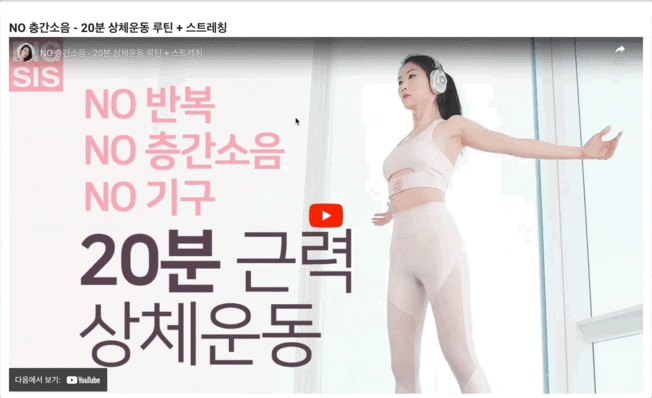

✅ Youtube 플레이어와 조회수 및 좋아요 수 표시

✅ 좋아요 토글 버튼 적용

✅ 리뷰 작성 및 리뷰 보기

✅ 본인이 작성한 리뷰만 수정, 삭제 가능.

  

---

### **🔗 영상 등록**

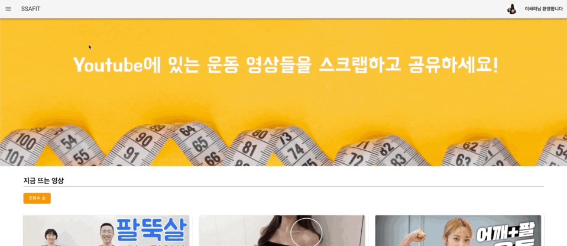

✅ Youtube Search API를 사용해 스크랩 할 Youtube 영상 주소를 입력

✅ 운동 부위를 직접 선택해 등록

  
